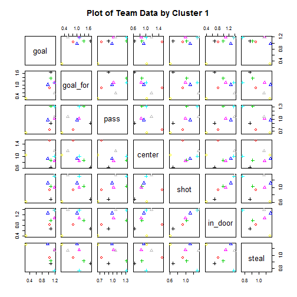
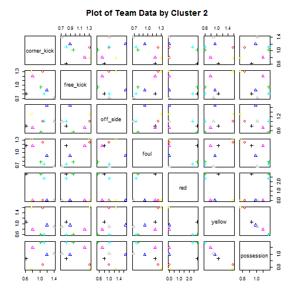

基于聚类分析的球队风格比较
========================================================
## Writen by Casper

*Just for fun*

## 1. Introduction


## 2. Obtain Data
获取数据是此分析中最耗时间的一环，无论是门户网站还是专业的体育网站都没有上面描述的那些详尽数据。而如OPTA此类专业体育统计机构的数据不对一般用户开放，可以想象博彩公司基于这些详尽数据，在精算师分析下产生的赔率设计肯定是有利于庄家的。幸好本文分析球队风格数据只是针对最近的几场小组赛(欧冠6轮，亚洲杯3轮)，而每场比赛以后会有本场比赛的数据，因此可以手动收集将这些数据建立成数据表。

欧冠的数据来自[腾讯体育](http://soccerdata.sports.qq.com/live.htm?mid=782698)，亚洲杯的数据来自于[网易体育](http://sports.163.com/15/0114/22/AFV30B6G00051C8M.html)和[搜达足球网](http://www.sodasoccer.com/dasai/league/result_statistics.jsp?mid=77E07E01DC4E6CF0)。下图为三个数据来源的统计类型重叠部分。因此，我们重新构建数据表，选取了重叠的8个统计类型："team", "goal", "goal_for", "pass", "center", "shot", "in_door", "steal", "corner_kick", "free_kick", "off_side", "foul", "red", "yellow", "possession"。

## 3. Clean the Data
导入相关package,读取csv数据

```r
library(ggplot2)
library(grid)
library(knitr)
euro <- read.csv("euro.csv")
```

首先看一下Data frame的结构,显示euro的前五列数据。

```r
kable(head(euro), format = "markdown")
```

```
## 
## 
## |team               | goal| goal_for| pass| center| shot| in_door| steal| corner_kick| free_kick| off_side| foul| red| yellow| possession|
## |:------------------|----:|--------:|----:|------:|----:|-------:|-----:|-----------:|---------:|--------:|----:|---:|------:|----------:|
## |Atlético de Madrid |    2|        3|  558|     46|   18|       5|    18|           8|        11|        2|   15|   0|      4|       59.0|
## |Atlético de Madrid |    1|        0|  288|     28|    8|       2|    28|           4|        26|        3|   21|   0|      2|       36.2|
## |Atlético de Madrid |    5|        0|  486|     39|   28|      10|    20|          11|        14|        5|   10|   0|      1|       57.4|
## |Atlético de Madrid |    2|        0|  361|     23|    9|       3|    23|           5|        16|        5|   16|   0|      5|       44.4|
## |Atlético de Madrid |    4|        0|  547|     42|   17|       6|    22|           7|        16|        3|   12|   0|      2|       58.4|
## |Atlético de Madrid |    0|        0|  280|     12|    6|       3|    13|           3|        14|        0|   15|   0|      2|       28.7|
```

数据表显示的是每一场比赛的数据，我们需要转变为场均数据。

```r
# 可以看到其中有三行是无数据的，将其排除（因为计算平均值，因此排除NA行不会对结果造成太大影响）
euro <- subset(euro, goal!="NA")

# 计算出每支队伍的场均数据
euro1 <- aggregate(euro[,-1], list(euro$team), mean)

# 为了接下来的cluster分析，删除数据表中的非numeric数据，将Team标示作为row.names
rownames(euro1) <- euro1[,1]
euro2 <- euro1[,-1]
```

做聚类分析之前，先要考虑一个问题。球队的进球、射门数数量级是不同的，比赛进球4个助攻的难度，远远高于射门4次的难度。因此如果不将衡量指标归一化，聚类就会不公平，射门次数(传球次数)就会变成主要的指标，而进球数就会变成次要的指标，控球率(百分比)在其中所占的份额就更加小，会导致聚类结果的偏差。从实际上来看，控球率以及进球数是球队进攻风格最重要的体现，因此将各种指标保持在同一个量级是非常重要的。为了解决这个问题，可以先计算所有队伍的数据平均值，再根据每队的数据与平均值的比例，得到每队的相对值。


```r
mean_data <- colMeans(euro2)

for (i in 1:nrow(euro2)){
    euro2[i,] = euro2[i,]/mean_data
}
```

## 4. Data Analysis
### 1. 分类算法
聚类分析的算法大体可以分为以下几种[1][2]:
- **划分聚类(partitioning methods)**：将包含n个对象的数据划分为k(k<=n)个聚类，给定k，即要构建的划分的数目，划分方法首先创建一个初始划分。然后采用一种迭代的重定位技术，尝试通过对象在划分间移动来改进划分,从而让在同一个类中的对象之间的距离尽可能小，而不同类中的对象之间的距离尽可能大。
- **层次聚类(hierarchical methods)**：一开始将所有的对象置于一个簇中。在迭代的每一步中，一个簇被分裂为更小的簇，直到最终每个对象在单独的一个簇中，或者达到一个终止条件。
- **基于模型的方法(model-based methods)**：基于模型的方法为每个簇假定了一个模型，寻找数据对给定模型的最佳匹配。一个基于模型的算法可能通过构建反映数据点空间分布的密度函数来定位聚类。它也基于标准的统计数字自动决定聚类的数目，考虑“噪音”数据和孤立点，从而产生健壮的聚类方法。

在此分析中，我们只考虑风格相似性，不关心球队实力等级比较，而且此分析属于非监督学习，并没有training数据，因此采用了划分聚类中常用的K-means算法。


K-means算法的流程分为六步[3]：

1. 确定K值(cluster的个数)
2. 随机挑选cluster的中心位置
3. 对于每个数据找出相距最近的中心
4. 每个中心1找到此中心相应的点所构成的中心2
5. 将中心1转变为中心2
6. 不断重复4-5步


### 2. K值确定
那么我们首先要确定需要将球队分为几类，按照K-means算法的定义，1<=K<=n，但是当K=n时无法满足任务需求，因此K的取值区间为[1,n-1]。与其随机选择K值再通过分析分类结果，我们计算了当K取各个值的cost value(sum of squares)[4]，并对K值和cost绘图分析。


```r
cost <- data.frame()

for(i in 1:(nrow(euro2)-1)){
    kmeans<- kmeans(euro2, centers = i)
    cost <- rbind(cost, cbind(i, kmeans$tot.withinss))
}
names(cost) <- c("cluster", "cost")
```

通过"elbow method"选择K值[5]。下图是Cluster和Cost的绘图结果，可以看出，K=3是一个breakpoint，当我们增加或者减少K值时，cost function的斜率都会增加。因此，将cluster定为3会取得不错的分类结果。


```r
ggplot(data=cost, aes(x=cluster, y=cost, group=1)) + 
    theme_gray() + 
    geom_line(colour = "darkgreen") +
    ggtitle("Reduction In Cost For Values of 'k'\n") +
    xlab("\nClusters") + 
    ylab("Within-Cluster Sum of Squares\n")
```

 

### 3. K-means聚类分析
以K=3，对球队比赛数据做K-means聚类分析

```r
cluster <- kmeans(euro2, 3)

euro3 <- cbind(euro1[,1], euro2)
colnames(euro3[1]) <- "team"
    
euro4 <- cbind(1:8, euro2)
```

对K-means结果绘图，因为参数较多，将两部分分开绘图，前半部分("goal", "goal_for", "pass"", "center", "shot", "in_door", "steal")，后半部分("corner_kick", "free_kick", "off_side", "foul", "red", "yellow", "possession")。图中同样的形状表示处于相同的cluster，颜色(颜色编号1-8)表示不同的队伍。


```r
plot(euro4[,2:8], pch = cluster$cluster, col = euro4[,1], 
     main = "Plot of Team Data by Cluster 1")
```

 


```r
plot(euro4[,9:15], pch = cluster$cluster, col = euro4[,1],
     main = "Plot of Team Data by Cluster 2")
```

 

可以看出相同的类别的点(同种形状)在大多参数下相似度都是非常高的，那么整体的分类结果是怎么样的呢？

```r
cluster
```

```
## K-means clustering with 3 clusters of sizes 2, 3, 3
## 
## Cluster means:
##     goal goal_for   pass center   shot in_door  steal corner_kick
## 1 0.6667   0.5634 0.6984 1.2740 0.7703  0.6117 1.0608      0.9266
## 2 1.1160   0.9014 1.0221 0.9835 1.1507  1.2461 1.1061      1.1309
## 3 1.1062   1.3897 1.1789 0.8339 1.0024  1.0128 0.8533      0.9180
##   free_kick off_side   foul   red yellow possession
## 1    1.3090   1.1389 1.2695 0.000 1.5725     0.8075
## 2    0.9357   1.1296 0.9259 0.000 0.8714     1.0333
## 3    0.8583   0.7778 0.8944 2.667 0.7469     1.0950
## 
## Clustering vector:
##            Arsenal Atlético de Madrid          Barcelona 
##                  3                  1                  3 
##            Chelsea  FC Bayern München           FC Porto 
##                  2                  3                  2 
##             Monaco        Real Madrid 
##                  1                  2 
## 
## Within cluster sum of squares by cluster:
## [1] 0.8096 1.2958 1.5127
##  (between_SS / total_SS =  82.9 %)
## 
## Available components:
## 
## [1] "cluster"      "centers"      "totss"        "withinss"    
## [5] "tot.withinss" "betweenss"    "size"         "iter"        
## [9] "ifault"
```


### 4. 分析子类
有了总体的分类结果，还可以对其中的某些column做进一步的分析，以检验其某类型的风格。此分析将球队比赛风格分成了四个角度，进攻、防守、掌控以及方式。
- 进攻：选取了"shot"和"goal"两个直观的指标；
- 防守：选取了"foul"和"steal"两个指标，"steal"体现了球队的防守效率，"foul"体现防守的凶悍程度；
- 掌控：选取了"pass"和"possession"两栏数据，传球("pass")和控球率("possession")都很能体现球队对比赛的场控；
- 方式：选取了"center"和"off_side"，越位("off_side")可以在一定程度上说明球队的直传数，对比传中数("center")，能够体现球队的进攻组织方式。


```r
# 把cluster的分类结果添加到euro4的data frame里面
euro4$cluster <- factor(cluster$cluster)

grid.newpage()
vplayout <- function(x, y) viewport(layout.pos.row = x, layout.pos.col = y)
pushViewport(viewport(layout = grid.layout(2, 2)))
plot1 <- ggplot(euro4, aes(x=goal, y=shot, color=cluster, label=rownames(euro4)))
plot1 <- plot1 + geom_text() + ggtitle("Offense") + theme(legend.position='none')
plot2 <- ggplot(euro4, aes(x=steal, y=foul, color=cluster, label=rownames(euro4)))
plot2 <- plot2 + geom_text() + ggtitle("Defense") + theme(legend.position='none')
plot3 <- ggplot(euro4, aes(x=pass, y=possession, color=cluster, label=rownames(euro4)))
plot3 <- plot3 + geom_text() + ggtitle("Control") + theme(legend.position='none')
plot4 <- ggplot(euro4, aes(x=center, y=off_side, color=cluster, label=rownames(euro4)))
plot4 <- plot4 + geom_text() + ggtitle("Style") + theme(legend.position='none')

print(plot1, vp = vplayout(1, 1))
print(plot2, vp = vplayout(1, 2))
print(plot3, vp = vplayout(2, 1))
print(plot4, vp = vplayout(2, 2))
```

 

## 5. Result


## Reference
1. Machine Learning in Action, Peter Harrington
2. http://blog.csdn.net/yaoyepeng/article/details/6281991
3. Unsupervised learning or Clustering, Carlos Guestrin 
4. http://randyzwitch.com/rsitecatalyst-k-means-clustering/
5. http://en.wikipedia.org/wiki/Determining_the_number_of_clusters_in_a_data_set
