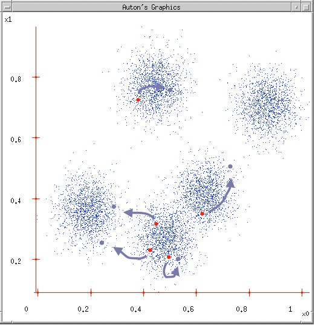

基于聚类分析的球队风格比较
========================================================
## Writen by Casper

*Just for fun*

## 1. Introduction


## 2. Obtain Data

## 3. Clean the Data
导入相关package,读取csv数据
```{r}
library(ggplot2)
library(grid)
library(knitr)
euro <- read.csv("euro.csv")
```

首先看一下Data frame的结构,显示euro的前五列数据。
```{r}
kable(head(euro), format = "markdown")
```

数据表显示的是每一场比赛的数据，我们需要转变为场均数据。
```{r}
# 可以看到其中有三行是无数据的，将其排除（因为计算平均值，因此排除NA行不会对结果造成太大影响）
euro <- subset(euro, goal!="NA")

# 计算出每支队伍的场均数据
euro1 <- aggregate(euro[,-1], list(euro$team), mean)

# 为了接下来的cluster分析，删除数据表中的非numeric数据，将Team标示作为row.names
rownames(euro1) <- euro1[,1]
euro2 <- euro1[,-1]
```

做聚类分析之前，先要考虑一个问题。球队的进球、射门数数量级是不同的，比赛进球4个助攻的难度，远远高于射门4次的难度。因此如果不将衡量指标归一化，聚类就会不公平，射门次数(传球次数)就会变成主要的指标，而进球数就会变成次要的指标，控球率(百分比)在其中所占的份额就更加小，会导致聚类结果的偏差。从实际上来看，控球率以及进球数是球队进攻风格最重要的体现，因此将各种指标保持在同一个量级是非常重要的。为了解决这个问题，可以先计算所有队伍的数据平均值，再根据每队的数据与平均值的比例，得到每队的相对值。

```{r}
mean_data <- colMeans(euro2)

for (i in 1:nrow(euro2)){
    euro2[i,] = euro2[i,]/mean_data
}
```

## 4. Data Analysis
### 1. 分类算法
聚类分析的算法大体可以分为以下几种[1][2]:
- **划分聚类(partitioning methods)**：将包含n个对象的数据划分为k(k<=n)个聚类，给定k，即要构建的划分的数目，划分方法首先创建一个初始划分。然后采用一种迭代的重定位技术，尝试通过对象在划分间移动来改进划分,从而让在同一个类中的对象之间的距离尽可能小，而不同类中的对象之间的距离尽可能大。
- **层次聚类(hierarchical methods)**：一开始将所有的对象置于一个簇中。在迭代的每一步中，一个簇被分裂为更小的簇，直到最终每个对象在单独的一个簇中，或者达到一个终止条件。
- **基于模型的方法(model-based methods)**：基于模型的方法为每个簇假定了一个模型，寻找数据对给定模型的最佳匹配。一个基于模型的算法可能通过构建反映数据点空间分布的密度函数来定位聚类。它也基于标准的统计数字自动决定聚类的数目，考虑“噪音”数据和孤立点，从而产生健壮的聚类方法。

在此分析中，我们只考虑风格相似性，不关心球队实力等级比较，而且此分析属于非监督学习，并没有training数据，因此采用了划分聚类中常用的K-means算法。


K-means算法的流程分为六步[3]：

1. 确定K值(cluster的个数)
2. 随机挑选cluster的中心位置
3. 对于每个数据找出相距最近的中心
4. 每个中心1找到此中心相应的点所构成的中心2
5. 将中心1转变为中心2
6. 不断重复4-5步



### 2. K值确定
那么我们首先要确定需要将球队分为几类，按照K-means算法的定义，1<=K<=n，但是当K=n时无法满足任务需求，因此K的取值区间为[1,n-1]。与其随机选择K值再通过分析分类结果，我们计算了当K取各个值的cost value(sum of squares)[4]，并对K值和cost绘图分析。

```{r}
cost <- data.frame()

for(i in 1:(nrow(euro2)-1)){
    kmeans<- kmeans(euro2, centers = i)
    cost <- rbind(cost, cbind(i, kmeans$tot.withinss))
}
names(cost) <- c("cluster", "cost")
```

通过"elbow method"选择K值[5]。下图是Cluster和Cost的绘图结果，可以看出，K=3是一个breakpoint，当我们增加或者减少K值时，cost function的斜率都会增加。因此，将cluster定为3会取得不错的分类结果。

```{r}
ggplot(data=cost_df, aes(x=cluster, y=cost, group=1)) + 
    theme_gray() + 
    geom_line(colour = "darkgreen") +
    ggtitle("Reduction In Cost For Values of 'k'\n") +
    xlab("\nClusters") + 
    ylab("Within-Cluster Sum of Squares\n")
```

### 3. K-means聚类分析
以K=3，对球队比赛数据做K-means聚类分析
```{r}
cluster <- kmeans(euro2, 3)

euro3 <- cbind(euro1[,1], euro2)
colnames(euro3[1]) <- "team"
    
euro4 <- cbind(1:8, euro2)
```

对K-means结果绘图，因为参数较多，分为前半部分(goal, goal_for, pass, center, shot, in_door, steal)和后半部分(corner_kick, free_kick, off_side, foul, red, yellow, possession)
```{r}
plot(euro4[,2:8], pch = cluster$cluster, col = euro4[,1], 
     main = "Plot of Team Data by Cluster 1")
```

```{r}
plot(euro4[,9:15], pch = cluster$cluster, col = euro4[,1],
     main = "Plot of Team Data by Cluster 2")
```

### 4. 分析子类
根据“进攻”、“防守”、对比赛的”掌控“和”风格“再进行分析
```{r}
# 把cluster的分类结果添加到euro4的data frame里面
euro4$cluster <- factor(cluster$cluster)

grid.newpage()
vplayout <- function(x, y) viewport(layout.pos.row = x, layout.pos.col = y)
pushViewport(viewport(layout = grid.layout(2, 2)))
plot1 <- ggplot(euro4, aes(x=goal, y=shot, color=cluster, label=rownames(euro4)))
plot1 <- plot1 + geom_text() + ggtitle("Offense") + theme(legend.position='none')
plot2 <- ggplot(euro4, aes(x=steal, y=foul, color=cluster, label=rownames(euro4)))
plot2 <- plot2 + geom_text() + ggtitle("Defense") + theme(legend.position='none')
plot3 <- ggplot(euro4, aes(x=pass, y=possession, color=cluster, label=rownames(euro4)))
plot3 <- plot3 + geom_text() + ggtitle("Control") + theme(legend.position='none')
plot4 <- ggplot(euro4, aes(x=center, y=off_side, color=cluster, label=rownames(euro4)))
plot4 <- plot4 + geom_text() + ggtitle("Style") + theme(legend.position='none')

print(plot1, vp = vplayout(1, 1))
print(plot2, vp = vplayout(1, 2))
print(plot3, vp = vplayout(2, 1))
print(plot4, vp = vplayout(2, 2))
```

## 5. Result


## Reference
1. Machine Learning in Action, Peter Harrington
2. http://blog.csdn.net/yaoyepeng/article/details/6281991
3. Unsupervised learning or Clustering, Carlos Guestrin 
4. http://randyzwitch.com/rsitecatalyst-k-means-clustering/
5. http://en.wikipedia.org/wiki/Determining_the_number_of_clusters_in_a_data_set
